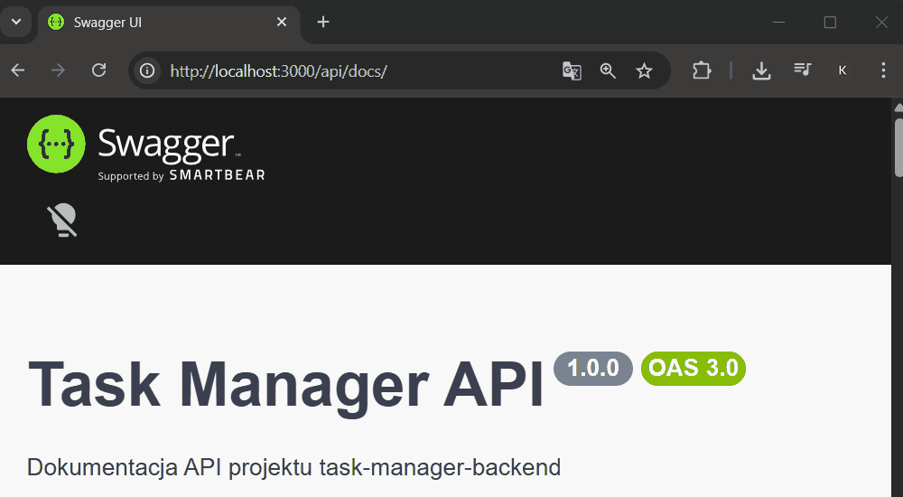
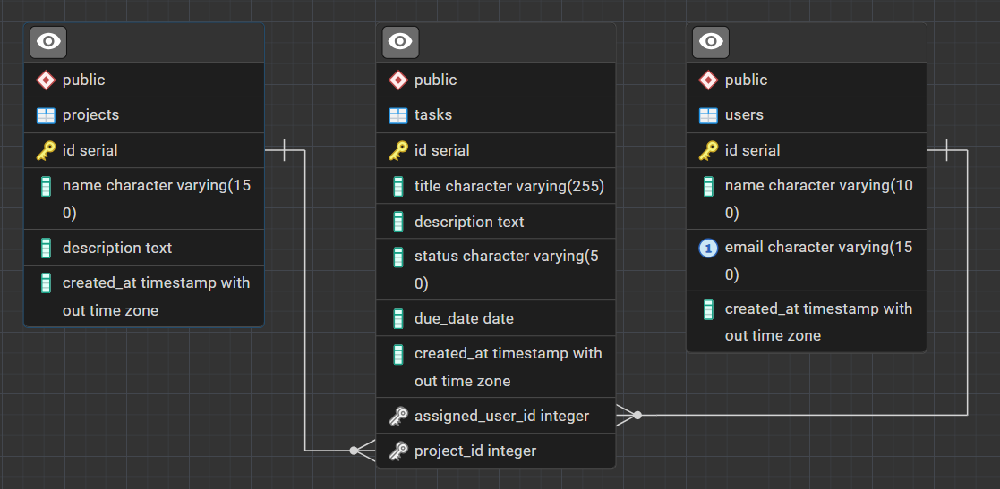

# Task Manager Backend

## Demo API



Backend API for managing projects and tasks.  
Created as part of a team project.

---
## Architecture

The application follows a simple 3-layer architecture:

- **Client layer** (e.g., Swagger UI / Postman)  
  interacts with the API via HTTP requests

- **Backend layer** (Node.js + Express)  
  handles routing, business logic and data processing

- **Database layer** (PostgreSQL)  
  stores users, projects and tasks with relational structure

## API Documentation

Swagger UI available at:

http://localhost:3000/api/docs

### Data relationships:
- One user can have many tasks
- One project can contain many tasks
- Each task belongs to one user and one project

The API follows REST principles and communicates using JSON.

## Database Diagram (ERD)



## Technologies

- Node.js
- Express
- PostgreSQL
- dotenv

---

## Project Structure
```text

task-manager-backend/
│
├── database/
│ └── init.sql # database schema + sample data
│
├── .env.example # environment variables template
├── .gitignore
├── db.js # database connection
├── server.js # main server file
├── package.json
└── package-lock.json
```
---

Installation

## Clone repository:

```bash
git clone https://github.com/krystianmarciniak/task-manager-backend.git
cd task-manager-backend
```
Install dependencies:
```bash
npm install
```
## Environment variables
Create .env file based on .env.example:
```text
PORT=3000
DB_HOST=localhost
DB_PORT=5432
DB_NAME=taskmanager
DB_USER=postgres
DB_PASSWORD=your_password_here
```
## Database setup

Create database in PostgreSQL:
```text
CREATE DATABASE taskmanager;
```
Import schema and data:
psql -U postgres -d taskmanager -f database/init.sql

## Run project
```text
npm run dev

or
node server.js
```
## API (basic)

Example endpoints:

- GET /projects
- GET /projects/:id
- GET /users
- GET /users/:id

## Notes
.env file is not included in repository for security reasons
node_modules is ignored (run npm install after cloning)
Database dump is included in database/init.sql

## Author
Krystian Marciniak

{
  "title": "Test Swagger",
  "description": "Sprawdzenie endpointu POST",
  "status": "todo",
  "due_date": "2026-04-20",
  "assigned_user_id": 1,
  "project_id": 1
}